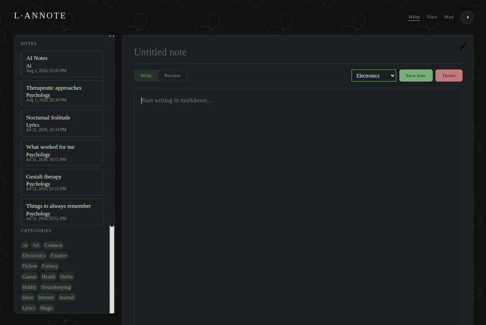

# L'annote



A simple notetaker, designed for taking notes, such as on a LAN, and a homeserver. It could be used on the web, for non essential notes.


- Notes are stored as .md markdown files, inside selected categories 

- It randomizes theme color one each refresh, for crisp and intuitive note keeping.

- Categories can be edited as a JSON file.

- Authentication is password based, plus IP restriction.


## Installation

- Move files to the server.

Make sure a directory called 'db' exists, below your `html` (parent) folder!

```
sudo chown -R www-data:www-data /var/www/html/Lannote
sudo mkdir -p /var/www/db
sudo chown -R www-data:www-data /var/www/db
sudo chmod -R 0775 /var/www/db
```

- Edit: ip.php and add your (local) IP's for extra safety.

- Call: setup.php and follow instructions.


Be sure to protect the auth files with .htaccess, if you want even tighter security:

Create .htaccess in the /data/ folder:

```
# notes/data/.htaccess
<IfModule mod_authz_core.c>
    Require all denied
</IfModule>
<IfModule !mod_authz_core.c>
    Order allow,deny
    Deny from all
</IfModule>
```

Then:

```nano /etc/apache2/apache2.conf```

Add: `AllowOverride All`

```
<Directory /var/www/>
        Options Indexes FollowSymLinks
        AllowOverride All
        Require all granted
</Directory>
```
Then:
```
sudo systemctl reload apache2
```


